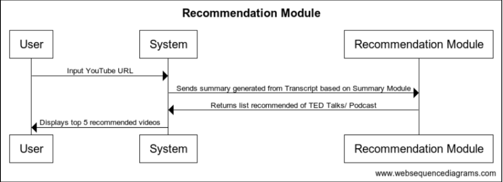
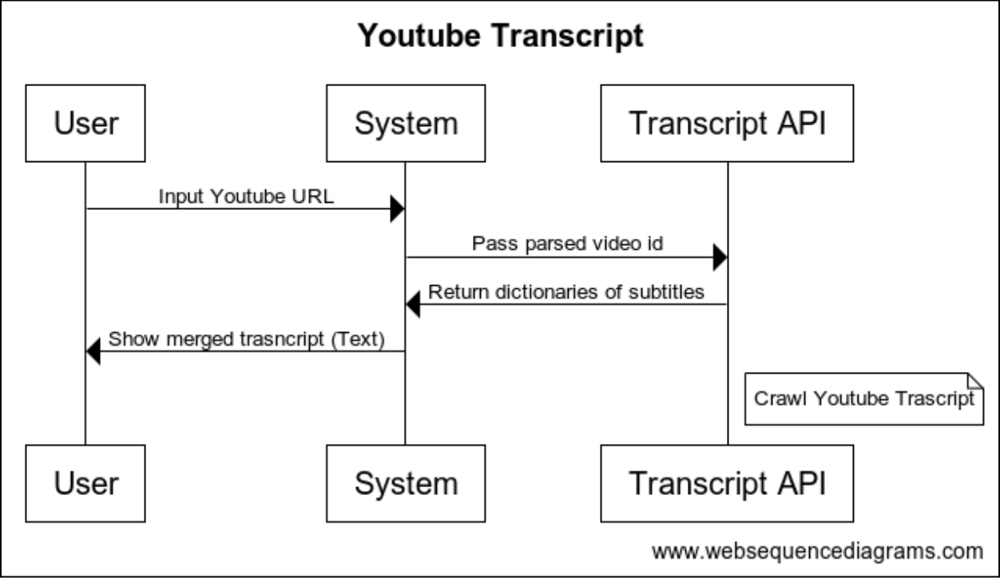
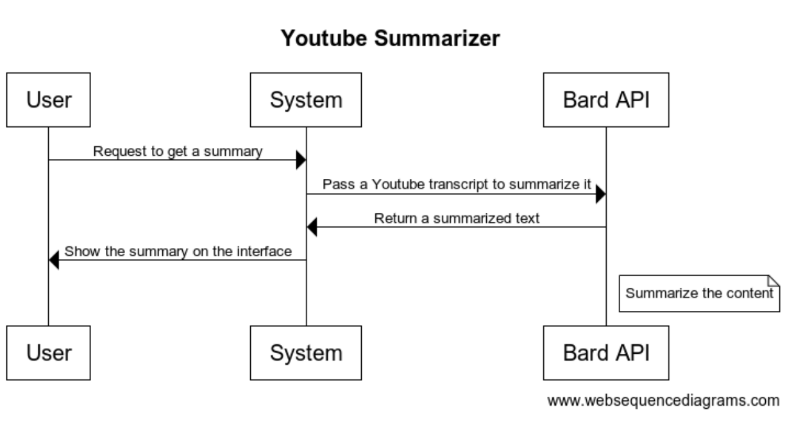
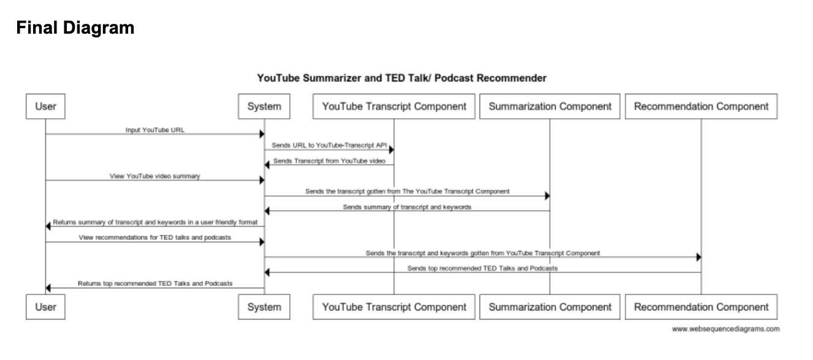

# Component Specification

This document will contain information about the following:
- **Software components**: High-level description of the software components such as data manager, which provides a simplified interface to your data and provides application-specific features (e.g., querying data subsets); and visualization manager, which displays data frames as a plot.
  - 3 components specifying what it does, inputs it requires, and outputs it provides. If you have more significant components in your system, we     highly suggest documenting those as well.
- **Interactions to accomplish use cases**: Describe how the above software components interact to accomplish your use cases.
  - one interaction diagram

## Use Case 1: TED Talk/ Podcast Recommendation System 

**Components:**
- User Interface to prompt YouTube video URL and selection options between summary and the recommendation system, and then between podcasts and TED Talks
- YouTube Video URL control logic to ensure it meets the specifications\
- Recommendation System control logic\
- User Interface for Recommendation System\

**Recommendation System Control Logic:**
- **Name**: Recommend
- **What it does**: It selects and shows the TED talks/ podcasts from our database that are most related to the provided YouTube video.
- **Inputs**: Takes the summary from the previous module (LLM Summarizer) 
- **Outputs**: A list of TED Talks and/or Podcasts that are relevant to the user’s inputted YouTube Video
- **Assumptions**: The summary outputted from the LLM Summarizer is an accurate representation of the YouTube video
- **How it uses other component**s: The Recommendation module is connected to the LLM Summarizer because the recommendation algorithm will use the summary to generate a similarity score to find and display relevant TED talks and podcasts

The diagram below depicts the interactions of the Recommendation System. This system takes in a YouTube URL provided by the user, and uses the Youtube Summary Module to obtain a summary of the video. Then this summary is given to the Recommendation module which will generate a similarity score to different TED Talks and Podcasts based on the user-inputted YouTube video. The system will take in these similarity scores and display the top 5 videos to the user. 

## Use Case 2: YouTube Summarizer System

**Components**:
- User Interface to prompt YouTube video URL and get a summary button
- YouTube Video URL control logic to ensure the URL is valid and has subtitles
- Summarization control logic
- User Interface to show the summary

**Youtube Transcript Module**
- **Name**: processTranscripts
- **What it does**: Getting a YouTube URL to crawl the transcript from users, crawls the transcript, and displays the result
- **Input**: Youtube Video URL
- **Output**: Crawled YouTube Transcript
- **Assumptions**: The URL is valid, and the video has subtitles.
- **How it uses other components**: The output will be used for a summarization component through GPT API.

The diagram below depicts the interactions of the components in the YouTube Transcript Module. This module takes in a given YouTube Video URL and passes the video ID from the YouTube link to the YouTube Transcript API. The API will then return a dictionary with subtitles and pass this to the system. The system will merge the dictionary together and display the merged transcript to the user. 

**Summarization Module:**
**Name**: summarizeTranscripts\
**What it does**: Creates a summary of a YouTube video Transcript\
**Inputs**: Youtube Video Transcript\
**Outputs**: Summary of YouTube video\
**Assumptions**: The given transcript will be detailed enough to create a relevant summary, and GPT API has a valid key and quota.\
**How it uses other components**: Uses the Youtube Transcript Component to obtain YouTube video Transcript to summarize\

The diagram below depicts the interactions of the components in the Summarization Module. In this module, the user has selected to see a summary of the YouTube Video. If this is the case, then the system will use the Youtube Transcript Module first to obtain a transcript, and will then pass it to the Bard API. The Bard API will take in the transcript and return the summarized text to the system. The system will then display the summary to the user. 

## Final Diagram

Putting all of the above components together will complete our application. Below, you can find a diagram of how our modules and components will interact with each other in a potential user workflow. 

